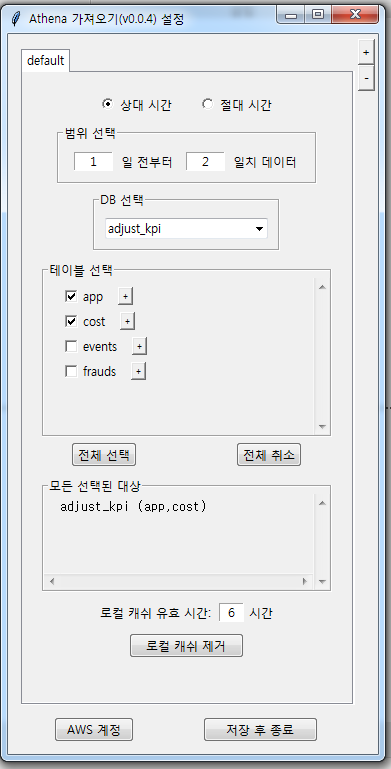
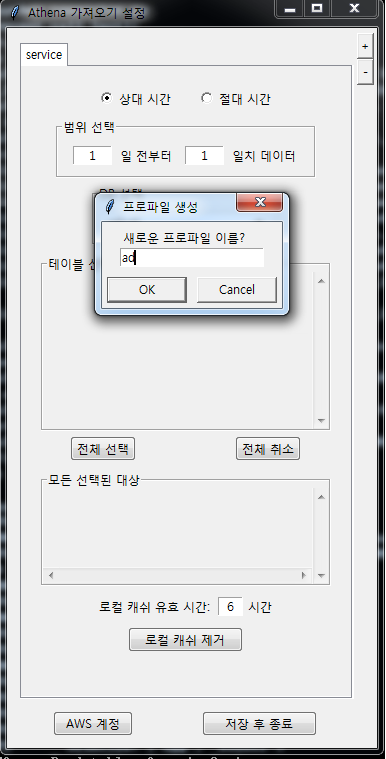

# pypbac
Power BI Athena Connector in Python

## 소개

마이크로소프트 Power BI에서 AWS Athena 데이터를 불러오기 위한 커넥터입니다. 파이썬으로 작성되었습니다.

다음과 같은 전제를 합니다:

- Athena의 테이블은 `year`, `month`, `day` 필드로 파티션됨.

## 설치 방법

1. [릴리즈](https://github.com/haje01/pypbac/releases/)에서 압축 파일을 받고, 적당한 디렉토리에 풉니다.
2. 먼저 디렉토리 내 `setting.exe`를 실행합니다.
3. 최초 한 번 AWS 계정 설정을 해줍니다.
4. 입력한 AWS 계정 정보로 접속에 성공하면, 불러오기 설정을 할 수 있습니다.

## 불러오기 설정하기

1. 먼저 불러올 대상 시간을 지정합니다. **상대 시간**과 **절대 시간**으로 나뉩니다.
  - 상대적인 시간 - 몇 일 전부터 몇 일치를 불러올지 지정
  - 절대 시간 - 구체적인 시작/종료 날자를 지정
2. 다음으로 DB를 선택합니다. DB가 선택되면, 거기에 있는 테이블 리스트가 나옵니다.
3. Power BI에서 불러올 테이블들을 체크합니다.
4. `저장 후 종료` 버튼을 눌러 설정을 저장하고 종료합니다.

### 테이블 상세 정보

가져올 테이블에 어떤 데이터와 컬럼이 있는지 확인하고, 가져올 컬럼을 선택할 수 있습니다.
1. `테이블 선택` 란에서 테이블 이름 옆에 있는 작은 '+' 버튼을 클릭합니다.
2. `테이블 상세` 대화창에서 데이터를 확인하고, 제외할 컬럼이 있으면 체크를 해제합니다.

## Power BI 설정하기

1. Power BI `옵션 및 설정` 메뉴의 `옵션`을 선택합니다.
2. 옵션 대화창에서 `Python 스크립팅`을 선택합니다.
3. `검색된 Python 홈 디렉터리` 란에서 `기타`를 선택합니다.
3. `Python 홈 디렉토리를 설정합니다.`란에서 `찾아보기`를 누릅니다.
4. 설치 단계에서 압축을 푼 디렉토리를 지정합니다.
5. `확인`을 누릅니다.

## Power BI에서 불러오기

1. `홈` 리본에 `데이터 가져오기`를 선택합니다.
2. 메뉴에서 `추가...`를 선택합니다.
3. `데이터 가져오기` 대화창의 입력란에서 `python`을 입력합니다.
4. `Python 스크립트`를 선택 후, `연결`을 누릅니다.
5. 이어 나오는 대화창은 공란을 허용하지 않기에, 일단 아무 문자나 입력합니다.
6. `확인`을 누르면 연결이 시작되고, 데이터를 가져옵니다.
7. 지정된 시간 범위나 테이블의 크기에 따라 다양한 시간이 소요됩니다.

## 캐쉬
- Power BI는 *불명한 이유로 파이썬 데이터 가져오기를 여러번 수행*합니다.
- 이에 대처하기 위해 pypbac는 로컬 디스크에 데이터를 **캐쉬**로서 저장합니다.
- 한 번 저장된 데이터는 로컬 캐쉬에서 빠르게 불러올 수 있습니다.
- 다음과 같은 경우 캐쉬는 무효화 되고, 다음 불러오기를 할 때 새로 가져오게 됩니다.
  - 생성된 이후 `로컬 캐쉬 유효 시간` 보다 오래된 경우
  - pypbac의 설정 파일이 변경된 경우
  - Power BI의 `Python 스크립트` 대화창의 내용이 바뀐 경우

## 프로파일

- Power BI를 이용해 다양한 데이터를 분석하는 경우, 하나의 설정은 부족할 수 있습니다.
- 예를 들어 한 서비스 분석 및 광고 분석을 각각하는 경우 대상 데이터의 시간이나 DB 등의 옵션은 다를 것 입니다.
- 이런 경우 서비스 분석은 `service`, 광고 분석은 `ad` 식으로 설정을 따로 저장할 수 있는데, 이를 **프로파일** 이라고 합니다.
- 기본 프로파일은 `default`이며, 우측 상단의 `+`와 `-` 버튼을 이용해 프로파일을 추가하거나 삭제할 수 있습니다.

### Power BI에서 프로파일 설정하기

- 앞에서 아무 문자나 입력했던 `Python 스크립트`의 대화창에서 프로파일 관련 정보를 지정할 수 있습니다.
- 대화창에서 아래와 같이 사용할 프로파일 이름을 명시합니다.
```
profile = service
```
- 프로파일 이름이 명시되지 않으면 기본적으로 `default` 프로파일이 이용됩니다.
- 만약 `default` 프로파일을 제거하고, 다른 이름으로 프로파일을 만들었다면, 꼭 위와 같이 프로파일을 명시해야 합니다.


## 간단한 SQL로 데이터 조작하기
- 전체 테이블 중 일부 행들만 필요하거나, 컬럼을 추가하는 등의 작업이 필요한 경우가 있습니다.
- pypbac는 간단한 부분 SQL 구문으로 컬럼을 추가하거나, 가져올 대상을 필터링할 수 있습니다. 
- 여기에서 사용되는 구문은 Athena(Presto)에 적용가능한 SQL 문이어야 합니다.
- 이를 위해 프로파일을 명시했던 Power BI의 `Python 스크립트` 대화창에서 추가적으로 기입합니다.

### 컬럼의 추가

- 기존의 컬럼을 조합하여 새로운 컬럼을 만들고 싶은 경우 다음과 같이 기입합니다.
```
[column]
1: concat(year, '-', month, '-', 'day) as date
2: 1 as one
```
- 각 행은 `행번호:`로 시작하고 내용을 SQL 구문으로 기술합니다.
- 예의 첫 번째 행은 `year`, `month`, `day` 컬럼을 `-`을 구분자로 결합한 후 `date`라는 새 컬럼을 추가합니다. 이렇게 하면 `2019-10-07` 형식의 날자 컬럼이 생기게 됩니다.
  - SQL 구문에서 문자열을 위한 따옴표는 *홑(작은)따옴표*를 사용하는 것에 주의하세요.
- 예의 두 번째 행은 테이블의 모든 행에 `1`이라는 상수값으로 `one` 컬럼을 추가합니다.
- 이것은 가져올 모든 대상 테이블에 대해 적용됩니다.

### 특정 테이블/DB에 대해서만 컬럼을 추가
- 특정 테이블, 또는 특정 DB의 테이블에 대해서만 컬럼 추가를 제한할 수 있습니다.
- 예를 들어 이름이 `user`인 테이블에 대해서만 컬럼을 추가하고 싶은 경우 다음과 같이 합니다.
```
[column.user]
1: 1 as one
```

- `kpi` DB의 `user` 테이블에 대해서만 컬럼을 추가하고 싶은 경우 다음과 같이 합니다.
```
[column.user.kpi]
1: 1 as one
```

### 필터의 추가

- 테이블 중 조건에 맞는 행들만 가져오고 싶은 경우 다음과 같이 기입합니다.
```
[filter]
1: country = 'kr'
2: age >= 20
```
- 컬럼 추가와 마찬가지로, 각 행은 `행번호:`로 시작하고 내용을 SQL 구문으로 기술합니다.
- 예의 첫 번째 행은 `country` 컬럼의 값이 `kr`인 행들을 선택하게 합니다.
- 예의 두 번째 행은 `age` 컬럼의 값이 20 이상인 행들을 선택하게 합니다.
- 하나 이상의 행이 있는 경우 모든 조건을 만족하는 행들만 가져옵니다. 
- 이것은 가져올 모든 대상 테이블에 대해 적용됩니다.

- 각 필터를 개별 행으로 기술하지 않고 다음처럼 하나의 행에 기술해도 괜찮습니다.
```
[filter]
1: country = 'kr' and age >= 20
```

### 특정 테이블/DB에 대해서만 필터를 추가
- 특정 테이블, 또는 특정 DB의 테이블에 대해서만 필터를 줄 수 있습니다.
- 예를 들어 이름이 `user`인 테이블에 대해서만 필터를 주는 경우 다음과 같이 합니다.
```
[filter.user]
1: country = 'kr'
```

- `kpi` DB의 `user` 테이블에 대해서만 필터를 주고 싶은 경우 다음과 같이 합니다.
```
[filter.user.kpi]
1: country = 'kr'
```

## Power BI 팁

### 이전 가져오기 이용하기
- 새로운 프로젝트에서 이전 `데이터 가져오기`의 `Python 스크립트` 설정을 그대로 사용한다면, 
- `홈` 리본의 `최근 원본` 버튼을 누른 후, 제일 위의 `Python`을 선택해 데이터를 빠르게 가져올 수 있습니다.

### Python 스크립트 수정 후 다시 가져오기

데이터를 가져온 후, `Python 스크립트` 대화창 내용을 수정하여 다시 가져올 수 있습니다.

1. `홈` 리본의 `새로 고침` 버튼을 클릭하여 쿼리 에디터를 띄웁니다.
2. 쿼리 에디터에서 새로 가져올 쿼리(테이블 이름)을 선택하고
3. 오른쪽 패널의 `적용된 단계` 첫 스텝인 `원본`의 설정(톱니바퀴) 버튼을 누릅니다.
4. `Python 스크립트` 대화창의 내용을 수정하고 `확인`을 누르면 다시 데이터를 가져옵니다.

## 개발자를 위한 설명

이후는 pypbac 개발자를 위한 설명입니다.

### 의존 모듈 설치
코드를 직접 실행하기 위해서, 다음과 같은 모듈 설치가 필요합니다.

- `pip install pyathena, dateutil, requests, pywin32`

### 빌드를 위한 설치

pypbac의 코드를 받은 후 직접 빌드(.exe 생성)하기 위해서는 아래와 같은 설치가 필요합니다.

- `pip install pyinstaller`
- `choco install zip`
- `choco install grep`
- `choco install sed`

이후 `build.bat`를 실행하면 `dist` 디렉토리 아래에 산출물이 생성됩니다.
